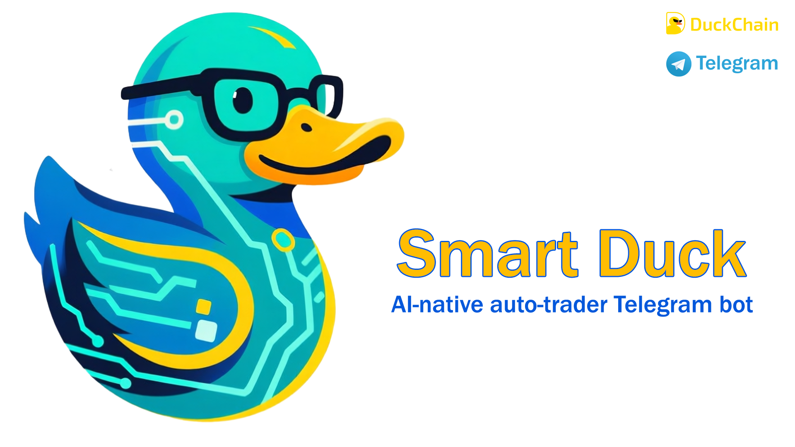

# Smart Duck
Fast, precise, and intelligent AI-native trading agent, built on DuckChain network.

## Smart Contract
- Deployed on Duckchain Mainnet at [0x0187e591daf84909be74d0c6e5e18efaafcd42ce](https://web3.okx.com/explorer/duckchain/address/0x0187e591daf84909be74d0c6e5e18efaafcd42ce)

## Relevant Links:
- Website: https://smartduck.hesameri.com
- Telegram Bot: http://t.me/smart_duckchain_bot

# Smart Duck
## What is Smart Duck?
Smart Duck is a sophisticated, AI-driven cryptocurrency trading bot specifically designed for the **DuckChain network**. Built with an AI-first approach, it provides fast, precise, and intelligent trading capabilities leveraging the unique advantages of DuckChain's infrastructure.

- **AI-Native Trading**: Powered by Gemini for advanced market analysis
- **User-Friendly**: Accessible through an intuitive Telegram bot interface
---

Smart Duck is a sophisticated, AI-driven cryptocurrency trading bot specifically designed for the **DuckChain network**. Built with an AI-first approach, it provides fast, precise, and intelligent trading capabilities leveraging the unique advantages of DuckChain's infrastructure.
## Core Features

- **Intelligent Risk Assessment**: Automated stop-loss and take-profit calculations
- **Price History Analysis**: 7-day price trend analysis with predictive insights

### Security & Fund Management

### User Interface

- **Scalable Architecture**: Built to handle high-frequency trading operations

## How Smart Duck Leverages DuckChain network

### Smart Contract Architecture

The main orchestration contract that manages:

Individual escrow contracts for each trading agent:

## Backend
### Architecture Overview
### 1. Trading Bot AI Engine

#### Core Agent System
- **Token Extraction**: Intelligently identifies cryptocurrency symbols from natural language
- **Market Analysis**: Processes price history and market data for insights
- **Price History Analysis**: 7-day trend analysis with statistical indicators
- **Volume Analysis**: Market volume patterns for liquidity assessment
- **Volatility Metrics**: Risk assessment based on price movements
**Live Market Integration**:
- **Real-Time Pricing**: Live price feeds for 30+ DuckChain network tokens
- **Intelligent Caching**: 5-minute cache duration for optimal performance
- **Background Updates**: Asynchronous data refreshing
- **Rate Limiting**: Respects API limits with built-in delays

#### System Architecture
The server acts as the central coordinator:
- **Database Management**: SQLite database for user data and agent configurations
- **Health Monitoring**: System status and uptime tracking
- **API Endpoints**: RESTful API for external integrations

#### Bot Architecture
The Telegram bot provides a rich, interactive interface:

**Core Features:**
- **Menu System**: Hierarchical navigation with inline keyboards
- **Agent Management**: Create, view, and manage trading agents
- **Real-Time Trading**: Execute trades directly through chat interface
- **Balance Monitoring**: Check escrow balances and transaction history
- **Error Handling**: Comprehensive error management with user-friendly messages

#### Key User Flows

**Agent Creation Flow:**
1. User initiates agent creation
2. System generates unique actor address using deterministic derivation

1. User inputs trading query (natural language)
2. AI analyzes request and market conditions

### Performance Metrics
- **Response Time**: <10 seconds for AI analysis
- **Cache Hit Rate**: >95% for price data requests
- **Uptime**: 99.9% availability target
- **Concurrent Users**: Supports 1000+ simultaneous users

### Security Features
- **Non-Custodial**: Users maintain full control of funds
- **Smart Contract Auditing**: OpenZeppelin battle-tested contracts
- **Input Validation**: Comprehensive prompt and data validation
- **Rate Limiting**: Protection against abuse and spam
- **Error Isolation**: Graceful failure handling

---

## Getting Started

1. Start a conversation with the Smart Duck Telegram bot (http://t.me/smart_duckchain_bot)
2. Create your first trading agent
3. Fund your escrow address with USDT & DUCK
4. Begin asking for trading advice and execute trades

---

**Built with ❤️ for the DuckChain ecosystem** 🌊
