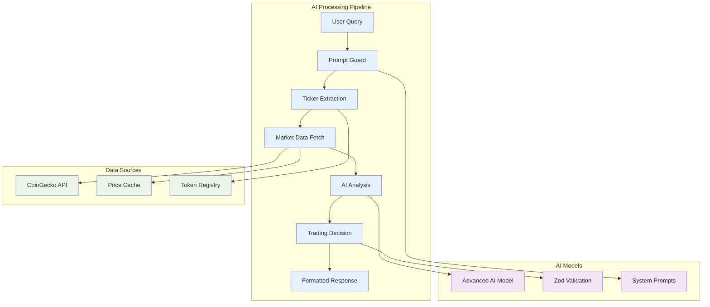

# AI Trading Engine Overview

## AI Engine Overview

The Smart Duck AI Engine is the cognitive core of the platform, powered by top-of-the-line fine-tuned latest AI models. It transforms natural language queries into sophisticated trading insights and actionable recommendations through advanced market analysis and risk assessment.



## Core AI Components

### 1. Agent Class Architecture

The `Agent` class serves as the foundation for all AI trading operations, providing a sophisticated workflow for processing user queries and generating trading insights.

```typescript
export class Agent {
  private ai: AIProvider;
  private model: ModelName;
  private preamble: string;
  
  constructor(config: {
    model: ModelName;
    preamble: string;
  }) {
    this.ai = new AIProvider({ apiKey: env.AI_API_KEY });
    this.model = config.model;
    this.preamble = config.preamble;
  }
}
```

#### Key Features
- **Modular Design**: Composable AI workflows for different trading scenarios
- **Type Safety**: Full TypeScript integration with Zod schema validation
- **Flexible Configuration**: Customizable AI model parameters and system prompts
- **Error Handling**: Comprehensive error recovery and fallback mechanisms

### 2. Enhanced Workflow System

The enhanced workflow is the primary entry point for AI processing, handling the complete journey from user input to trading recommendation.

```typescript
async enhancedWorkflow(userPrompt: string, walletBalance?: number): Promise<{
  guardResult: PromptGuardResult;
  tickerResult?: TokenExtractionResult;
  priceHistory?: any;
  tradeDecision?: TradeDecision;
  genericAdvice?: GenericAdvice;
  contextRequest?: ContextRequest;
  marketSummary?: any;
  error?: string;
}>
```

#### Workflow Stages

1. **Prompt Guard**: Validates input for trading relevance
2. **Ticker Extraction**: Identifies cryptocurrency symbols
3. **Data Retrieval**: Fetches relevant market data
4. **AI Analysis**: Processes data through advanced AI model
5. **Decision Generation**: Creates actionable trading recommendations
6. **Response Formatting**: Structures output for user consumption

## AI Engine Capabilities

### Natural Language Processing
- **Query Understanding**: Interprets natural language trading requests
- **Context Awareness**: Maintains conversation context
- **Intent Recognition**: Identifies user trading intentions
- **Multi-Language Support**: Handles various query formats

### Market Analysis
- **Technical Analysis**: Chart patterns and indicators
- **Fundamental Analysis**: Token fundamentals and ecosystem
- **Sentiment Analysis**: Market sentiment and trends
- **Risk Assessment**: Comprehensive risk evaluation

### Trading Intelligence
- **Entry/Exit Points**: Precise trading recommendations
- **Stop Loss/Take Profit**: Risk management levels
- **Position Sizing**: Optimal trade size calculations
- **Portfolio Optimization**: Multi-token strategies

## Technology Stack

### AI Models
- **Advanced AI Model**: Top-of-the-line fine-tuned latest AI models
- **Custom Prompts**: Specialized trading prompts
- **Structured Output**: Zod schema validation
- **Response Caching**: Intelligent response caching

### Data Integration
- **CoinGecko API**: Real-time market data
- **Price Cache**: Optimized data caching
- **Token Registry**: Comprehensive token database
- **Historical Data**: 7-day price history

### Performance Features
- **Fast Response**: Sub-second response times
- **High Accuracy**: Validated trading recommendations
- **Scalable Architecture**: Handles concurrent requests
- **Error Recovery**: Robust error handling
