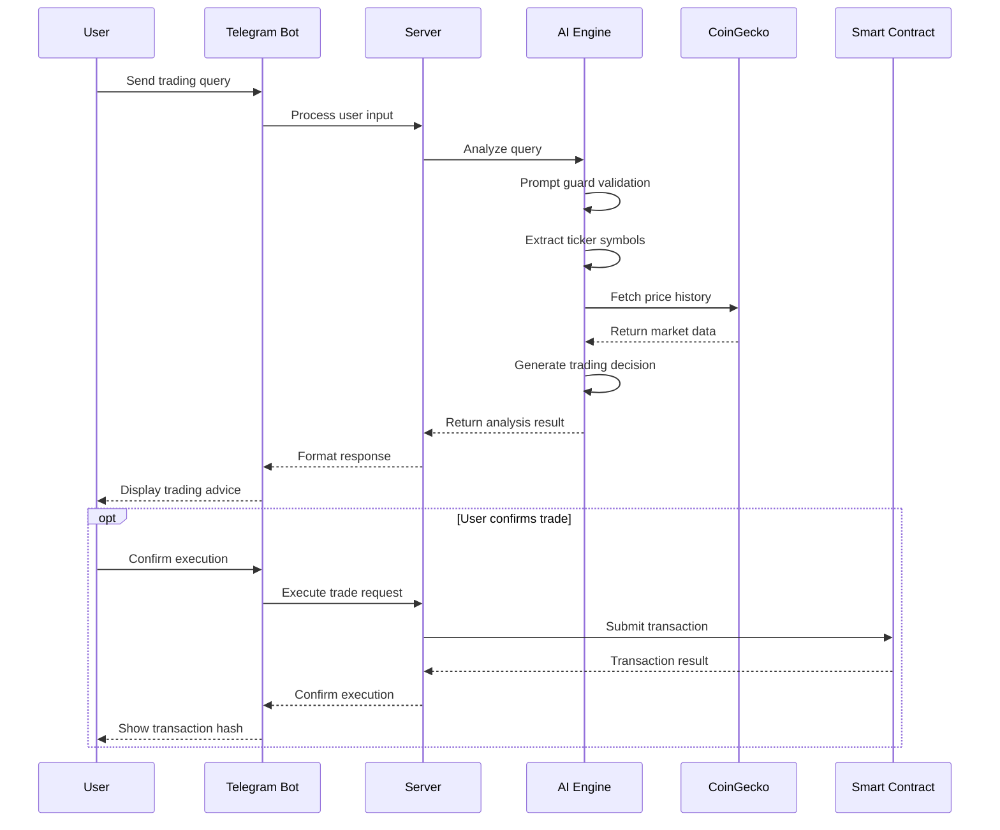
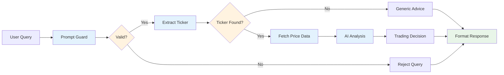

# Data Flow Architecture

## User Query Processing Flow

## AI Analysis Pipeline

## Data Flow Stages

### 1. Input Processing
- **User Input**: Natural language trading queries
- **Validation**: Input sanitization and format checking
- **Routing**: Request routing to appropriate handlers

### 2. AI Processing
- **Prompt Guard**: Validates query relevance for trading
- **Token Extraction**: Identifies cryptocurrency symbols
- **Market Data Fetch**: Retrieves price history and market data
- **AI Analysis**: Processes data through advanced AI model
- **Decision Generation**: Creates trading recommendations

### 3. Response Generation
- **Format Response**: Structures AI output for user consumption
- **Add Context**: Includes relevant market information
- **Error Handling**: Graceful handling of processing errors

### 4. Trade Execution (Optional)
- **User Confirmation**: User approves trade execution
- **Transaction Submission**: Smart contract interaction
- **Confirmation**: Transaction result and hash

## Data Sources and Sinks

### Input Data Sources
- **User Queries**: Natural language trading requests
- **Market Data**: Real-time price and volume information
- **Portfolio Data**: Current holdings and balances
- **Historical Data**: Past trading performance

### Output Data Sinks
- **User Interface**: Formatted responses and recommendations
- **Database**: Transaction records and user data
- **Blockchain**: Smart contract interactions
- **Cache**: Frequently accessed data storage

## Performance Considerations

### Caching Strategy
- **Price Data**: 5-minute cache for market data
- **User Data**: Session-based caching for user information
- **AI Responses**: Intelligent caching for similar queries

### Background Processing
- **Data Updates**: Asynchronous market data refreshing
- **Cache Warming**: Pre-loading essential data
- **Queue Management**: Efficient request queuing

### Error Handling
- **Graceful Degradation**: System continues operating during partial failures
- **Retry Logic**: Automatic retry for transient failures
- **Fallback Mechanisms**: Alternative data sources when primary fails
