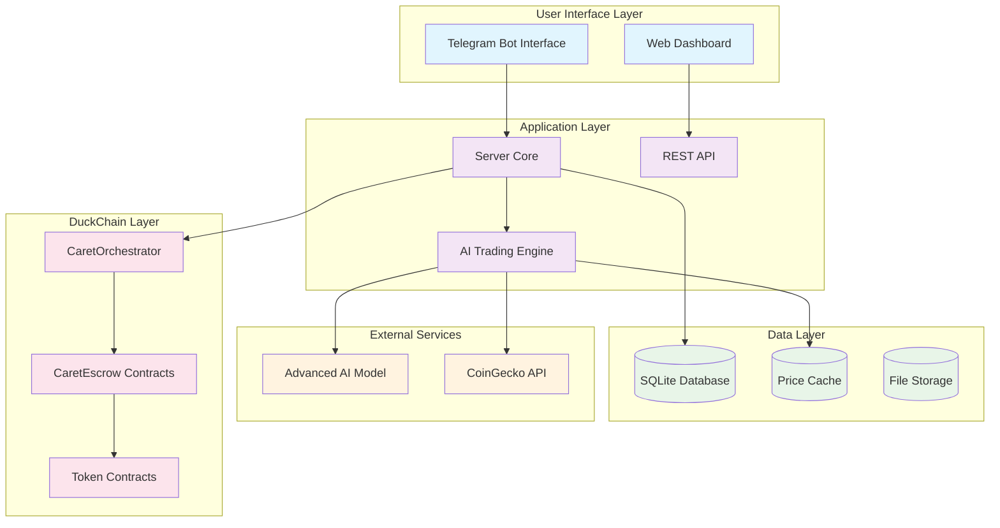

# System Architecture Overview

## High-Level Architecture

Smart Duck implements a modular, microservices-inspired architecture designed for scalability, security, and maintainability on DuckChain.

## Architecture Principles

### 1. Modularity
- **Component Isolation**: Each component operates independently
- **Clear Interfaces**: Well-defined APIs between components
- **Loose Coupling**: Components can be modified without affecting others

### 2. Security-First Design
- **Multi-Layer Security**: Security at every architectural level
- **Non-Custodial**: Users maintain control of their funds
- **Smart Contract Security**: Audited contracts with access controls

### 3. Performance Optimization
- **Caching Strategy**: Multi-level caching for optimal performance
- **Async Processing**: Non-blocking operations for better responsiveness
- **Database Optimization**: Efficient queries and indexing

### 4. Scalability
- **Horizontal Scaling**: Stateless design allows multiple instances
- **Vertical Scaling**: Optimized resource usage
- **Load Distribution**: Efficient handling of concurrent requests

## System Layers

### User Interface Layer
- **Telegram Bot**: Primary user interface for trading operations
- **Web Dashboard**: Administrative and monitoring interface
- **API Endpoints**: RESTful API for external integrations

### Application Layer
- **Server Core**: Main application logic and request handling
- **AI Trading Engine**: Advanced AI-powered trading analysis
- **API Gateway**: Request routing and authentication

### Data Layer
- **SQLite Database**: Persistent storage for user data and transactions
- **Price Cache**: In-memory caching for market data
- **File Storage**: Static assets and configuration files

### External Services
- **Advanced AI Model**: Top-of-the-line fine-tuned latest AI models for trading analysis
- **CoinGecko API**: Real-time cryptocurrency market data

### DuckChain Layer
- **CaretOrchestrator**: Main smart contract for agent management
- **CaretEscrow Contracts**: Secure fund management for each agent
- **Token Contracts**: ERC-20 token contracts on DuckChain

## Technology Stack

### Backend Technologies
- **Runtime**: Bun.js for high-performance JavaScript execution
- **Database**: SQLite for lightweight, embedded database
- **AI**: Top-of-the-line fine-tuned latest AI models for advanced analysis
- **Blockchain**: DuckChain with EVM compatibility

### Frontend Technologies
- **Telegram Bot API**: Rich interface with inline keyboards
- **React**: Modern web interface for dashboard
- **TypeScript**: Type-safe development across the stack

### Infrastructure
- **Deployment**: Cloudflare Workers for edge computing
- **Caching**: Multi-level caching strategy
- **Security**: HTTPS/TLS encryption and rate limiting
