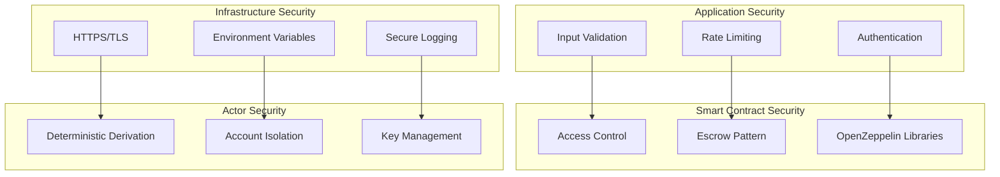

# Security Architecture

## Multi-Layer Security Model



## Actor System Security

### Deterministic Key Derivation
```typescript
export async function deriveActor(seed: string) {
  // Deterministic key generation
  const hash = keccak256(toBytes(seed));
  const pvtKey = hash as `0x${string}`;
  
  // Isolated wallet client
  return createWalletClient({
    chain: primaryChain,
    account: privateKeyToAccount(pvtKey),
    transport: http(primaryChain.rpcUrls.default.http[0]),
  }).extend(publicActions);
}
```

### Security Features
- **Deterministic Generation**: Predictable actor addresses from user seeds
- **Account Isolation**: Each agent has separate blockchain account
- **Non-Custodial**: Server never holds user private keys
- **Escrow Protection**: Funds secured in smart contracts

## API Security

### Rate Limiting & Validation
```typescript
// Input validation schema
const TradeRequestSchema = z.object({
  agentId: z.number().positive(),
  tokenSymbol: z.string().min(1).max(10),
  amount: z.string().regex(/^\d+(\.\d+)?$/),
  action: z.enum(["BUY", "SELL"])
});

// Rate limiting implementation
const rateLimiter = new Map<string, RateLimit>();
const RATE_LIMIT = { requests: 10, window: 60000 }; // 10 requests per minute
```

### Authentication & Authorization
- **User Authentication**: Secure user identification
- **Agent Authorization**: Verify agent ownership
- **Transaction Signing**: Secure transaction execution
- **Access Control**: Role-based permissions

## Smart Contract Security

### Access Control Patterns
```solidity
// Server-only operations
modifier onlyServer() {
    require(msg.sender == server, "Not the server");
    _;
}

// Actor-only operations
modifier onlyActor() {
    require(msg.sender == actor, "Not the actor");
    _;
}
```

### Security Best Practices
- **OpenZeppelin Libraries**: Battle-tested security patterns
- **Reentrancy Protection**: Prevent reentrancy attacks
- **Integer Overflow Protection**: Safe math operations
- **Access Control**: Strict permission management

## Data Security

### Encryption & Privacy
- **HTTPS/TLS**: Encrypted data transmission
- **Environment Variables**: Secure configuration management
- **Database Encryption**: Encrypted data storage
- **Log Sanitization**: Remove sensitive data from logs

### Input Validation
- **Schema Validation**: Strict input validation
- **Sanitization**: Clean user inputs
- **Type Safety**: TypeScript for compile-time safety
- **Boundary Checking**: Prevent buffer overflows

## Infrastructure Security

### Deployment Security
- **Secure Environment**: Isolated deployment environment
- **Secret Management**: Secure API key storage
- **Network Security**: Firewall and access controls
- **Monitoring**: Security event monitoring

### Incident Response
- **Security Monitoring**: Real-time threat detection
- **Incident Response Plan**: Defined response procedures
- **Audit Logging**: Comprehensive security logs
- **Recovery Procedures**: Data and system recovery

## Security Compliance

### Regulatory Compliance
- **Data Protection**: GDPR compliance for user data
- **Financial Regulations**: Compliance with trading regulations
- **Audit Requirements**: Regular security audits
- **Documentation**: Security policy documentation

### Best Practices
- **Regular Updates**: Keep dependencies updated
- **Security Testing**: Regular penetration testing
- **Code Reviews**: Security-focused code reviews
- **Training**: Security awareness training
