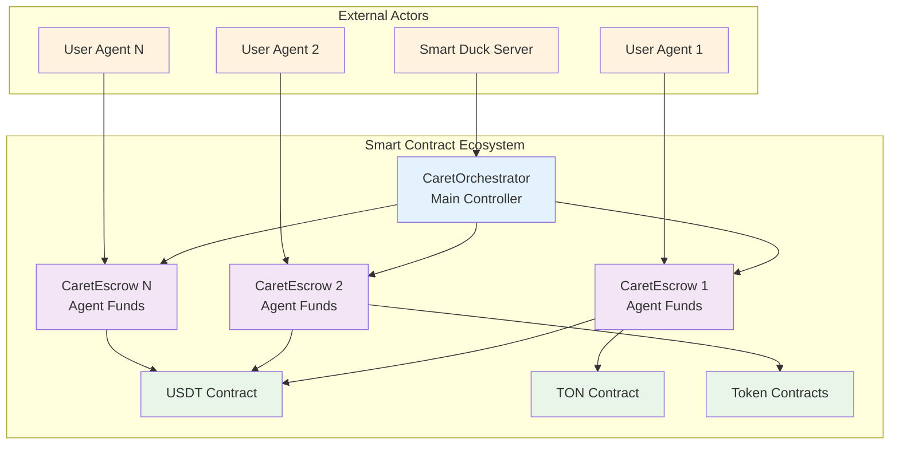

# Smart Contracts Overview

## Contract Architecture Overview

Smart Duck's smart contract system implements a secure, modular architecture for managing trading agents and their associated funds on the DuckChain. The system consists of three core contracts working in harmony to provide a safe, non-custodial trading environment.



## Contract Specifications

### 1. CaretOrchestrator Contract

The `CaretOrchestrator` is the central management contract that coordinates all trading agents and their associated escrow contracts.

#### Contract Details
- **File**: `evm/src/CaretOrchestrator.sol`
- **Dependencies**: OpenZeppelin ERC20, CaretEscrow
- **Access Control**: Server-only operations with `onlyServer` modifier

#### State Variables
```solidity
contract CaretOrchestrator {
    address public server;                           // Authorized server address
    IERC20 public usdt;                             // USDT token contract reference
    mapping(uint256 => address[]) public actors;    // User ID → Actor addresses
    mapping(address => bool) public isActor;        // Actor registration status
    mapping(address => address) public escrows;     // Actor → Escrow mapping
    mapping(string => address) public tokens;       // Symbol → Token address
}
```

#### Core Functions

##### Constructor
```solidity
constructor(address server_, address usdt_)
```
**Purpose**: Initializes the orchestrator with server and USDT contract addresses
- `server_`: Address of the authorized Smart Duck server
- `usdt_`: Address of the USDT token contract

##### registerActor
```solidity
function registerActor(uint256 owner_, address actor_) external onlyServer
```
**Purpose**: Registers a new trading agent and deploys its escrow contract
- `owner_`: User ID who owns this agent
- `actor_`: Derived address of the trading agent
- **Creates**: New `CaretEscrow` contract for this agent
- **Updates**: `actors`, `isActor`, and `escrows` mappings

**Process Flow**:
1. Validates actor is not already registered
2. Adds actor to user's actor list
3. Marks actor as registered
4. Deploys new escrow contract
5. Maps actor to escrow address

## Security Features

### Access Control
- **Server-Only Operations**: Critical functions restricted to authorized server
- **Actor Validation**: Ensures only registered actors can perform operations
- **Owner Verification**: Validates user ownership of agents

### Fund Security
- **Escrow Pattern**: Funds held in isolated escrow contracts
- **Non-Custodial**: Server never directly holds user funds
- **Controlled Access**: Only actor or server can manage escrow funds

### Audit Trail
- **Event Logging**: All operations logged as blockchain events
- **Transparency**: All transactions verifiable on-chain
- **Immutable Records**: Permanent transaction history

## Contract Interactions

### Registration Flow
1. **User Request**: User requests new agent creation
2. **Server Validation**: Server validates user and generates actor address
3. **Contract Call**: Server calls `registerActor` on orchestrator
4. **Escrow Deployment**: Orchestrator deploys new escrow contract
5. **Address Mapping**: Actor address mapped to escrow address
6. **User Notification**: User receives escrow address for funding

### Trading Flow
1. **Trade Request**: User requests trade execution
2. **Server Processing**: Server validates trade and calculates amounts
3. **Escrow Interaction**: Server calls escrow contract functions
4. **Token Transfer**: Tokens transferred between escrow and DEX
5. **Balance Update**: Escrow balances updated
6. **Transaction Log**: Trade logged in transaction history

## Network Integration

### DuckChain Compatibility
- **EVM Compatibility**: Full Ethereum Virtual Machine support
- **Fast Finality**: Sub-second transaction finality
- **Low Fees**: Minimal transaction costs
- **High Throughput**: Parallel transaction processing

### Token Standards
- **ERC-20 Support**: Standard token interface compliance
- **Wrapped Tokens**: Native tokens wrapped for EVM compatibility
- **Multi-Token Support**: Support for 30 tokens from the DuckChain ecosystem, expanding to more
